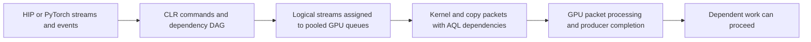

# Stream scheduling and native-wait admission

Current design and evidence, 2026-09-18. Target: ROCm 7.2.4 / gfx950, unchanged
HIP/PyTorch APIs and retained application code.

**Selected candidate:** strict native admission at 24 unread producer kernels,
plus stable node-count-based graph placement with the original enqueue order.
Keep actual-enqueue stream tails for correctness. Keep original dependency packets
and all physical-queue, signal-ABI/value and retirement checks. Do not enable
unconditional bypass, marker omission or launch-stream-role suppression.

This candidate retains **95.7–95.9% waiter-excess removal**, passes the completed
microbenchmark gates, and reaches **15.23–15.26 ms/token** on HiSparse C1 prefetch-on:
about 9% faster than admission24 alone and 15.4% faster than guarded256, with
prefetch-off effectively neutral. It remains **2.3–2.4% above the historical best**
of 14.897670 from a separate cohort. It is close, but not production-qualified.

## Stock architecture

A stream orders its work; events introduce cross-stream dependencies. Different
logical streams do not guarantee distinct physical queues or concurrent execution.
CLR uses completion signals and AQL dependency packets to preserve signal conditions,
memory ordering and completion notification. A queue read index measures packet
progress, not a kernel's remaining execution time.

For captured graphs, the segmented scheduler partitions the DAG, groups segments
by dependency level, and assigns streams round-robin within each level. It enqueues
segments, inserts cross-stream dependency markers, then joins stream endpoints back
to the launch stream. Segments supply completion signals and CPU batch-retirement
boundaries. The stock classic fallback applies to at least 16 segments averaging
fewer than 8 nodes. Thus captured graphs with similar application intent can follow
different scheduler paths. Our grouped4 fixture follows that fallback; grouped25
exercises the segmented policy.

Queue pooling is another independent concern. The earlier four-expert test used
only three physical queues. The bounded spare-stream correction already in v9
repairs that collision case; it is distinct from the new admission/placement choice.

## What changes, and why

**Native admission.** Our optional path prepends a vendor packet containing PM4
`WAIT_REG_MEM` on the producer signal, then retains the original AQL dependency.
It changes where waiting occurs; it does not replace the synchronization contract.
The added packet, instruction-storage retirement and consumer handoff have costs.
The correct optimization target is the critical-path latency of the whole DAG:

`producer interference avoided > added handoff + packet/retirement cost`.

Released v9 admits this prewait only with a distinct tracked physical producer
queue and at least 256 recorded producer kernels still unread. History records
actual kernel positions, not total packet span; pending cross-queue dependencies
and engine transitions reset independent-segment history. Unknown metadata or
unavailable nonblocking queue lookup falls back to AQL. The candidate lowers only
the cost threshold to 24. It retains all correctness and physical eligibility rules.
Dispatch count is an empirical cost heuristic, not proof of remaining GPU work.

**Graph placement.** The candidate prepares a separate cached assignment order at
graph scheduling: descending segment node count, stable baseline ties. Enqueue order
stays unchanged. Placement can change queue serialization, overlap and producer
history without changing the graph dependencies. Node count is a cheap heuristic;
it does not model kernel duration, resource saturation or true critical-path length.
No sorting or priority-vector allocation occurs on replay.

**Actual stream tails.** Greatest dependency level does not identify the last
submission when independent segments share a level and logical stream. Placement
exposed premature completion from that old reconstruction. Track the actual last
enqueued command per logical stream instead, preserving per-segment ownership and
original dependencies. This is an unconditional correctness fix, independent of
whether the placement optimization ships. It is already pushed in PR1.

No kernel-driver or firmware replacement is required for this CLR overlay. The
precise lower-level cause of the original waiter interference and short-join
handoff cost remains unproved; do not attribute every stock wait to a particular
shader or infer firmware behavior from timings alone.

## Tradeoffs resolved by experiments

| Candidate | Evidence | Decision |
|---|---|---|
| Unconditional cost bypass | Queued two-/four-stream controls regress roughly 88%/74% | Reject |
| Strict admission24 | About 7% C1 prefetch-on gain; off neutral; held-out admission64 behaves as the proxy predicted | Retain |
| Enqueue reordering alone | Near neutral on grouped25 | Do not include |
| Successor-depth placement | Roughly 0.4% grouped loss, repeated across six rounds | Reject |
| Node-count placement alone | Grouped25 improves roughly 4–5% in two allocations; C1 improves another 9% | Retain as empirical heuristic |
| Placement plus enqueue reordering | Same maps as legacy, but mixed-workload timing sensitivity remains | Prefer placement alone |
| Launch-stream-role prewait suppression | Grouped micro regressions around 5%, despite earlier model benefit | Reject global rule |
| Marker omission | Model median effects dominated by retained variable trials; causal benefit unresolved | Do not include |
| Actual-enqueue completion tails | Old bytes fail with native waits off and on; corrected completion/lifecycle checks pass | Keep independently |

Streams help when independent work leaves complementary hardware capacity available.
They can lose when branches saturate the same compute, bandwidth or cache resources,
or when repeated joins cost more than overlap saves. In the latest fixed-work
attention case, two streams take 211.63 us versus 355.15 us serial (about 1.68x);
the candidate runtime is nearly neutral relative to stock on that case. Small
transfers and producer-consumer boundaries are tested separately from large-copy
throughput. More streams or a larger overlap percentage is not itself success.

## What is established and what is not

The corrected placement factorial isolates assignment from submission order and
repeats the grouped gain. It establishes placement sufficiency for that fixture;
fewer aggregate native emissions do not establish the mechanism of the saving.
See [placement/order evidence](benchmarks/dispatch_cost/GRAPH_PLACEMENT_RESULTS.md).

Broad holdouts cover queued chains, fanout caps4/8, grouped4, small-KV attention-fetch,
H2D/D2H pipelines, fixed-work attention and the original waiter. Initial noisy
attention losses did not recur in an independent unchanged allocation. All trials
remain retained. These broad cases have no changed placement positions, so they
extend admission/overhead/fallback coverage rather than active-reassignment topology
coverage. See [complete holdouts and limits](benchmarks/dispatch_cost/GRAPH_TAIL_HOLDOUT_RESULTS.md).

C1 used six separately started residents, forward/reverse order, three retained
on/off requests per resident, exact libraries and six-worker control/map audits.
The 36 request means are nested observations, not 36 independent runtime starts.
Order balances linear drift, but nonlinear middle-of-run effects can favor both
placement residents. The per-block gain/off bounds are screening gates, not
confidence bounds. The historical best is a separate comparison cohort. See
[all C1 trials and frozen predictions](benchmarks/dispatch_cost/C1_PLACEMENT_RESULTS.md).

Exact-byte completion tests, event/queue lifecycle checks and PyTorch event/graph
checks passed. Child-graph tests cover the implementation's internally single-stream
path; they do not prove nested cross-stream behavior. Multi-device graph assignment
has a known preexisting limitation that reordering can expose. Production placement
must be restricted to qualified single-device graphs unless that path is separately
fixed and qualified. See [completion coverage](benchmarks/graph_completion/README.md).

## Productionization and remaining gates

1. Natural-generation screening passed 12/12 retained long-context probes on
   admission24 and placement24, prefetch on/off, trace0. An untimed trace verifies
   physical launch/side placement on all four ranks. Its planned exact cross-resident
   graph match failed because captures differ; the accepted proof is narrower and
   does not explain the magnitude of the C1 gain. See [model checks and limits](benchmarks/dispatch_cost/C1_MODEL_CHECKS.md).
2. C4 is running with the retained client, six separately started residents and
   forward/reverse order. Its performance gates remain pending.
3. Port only the selected changes into a minimal implementation: cached stable
   assignment, baseline enqueue order, strict admission24, single-device qualification
   boundary, device-change invalidation and unconditional actual tails. The prepared
   source invalidates cached eligibility even when a parameter setter subsequently
   fails; ordinary same-device updates preserve it. Remove rejected diagnostics. Do not
   change history capacity, packet alignment/retirement or signal eligibility.
   Removing diagnostics also removes host work and an unused instruction word;
   those compiled differences require the new-byte performance bridge.
4. Build and validate exact production-candidate bytes: rebuild/performance bridge,
   required correctness checks and final model confirmation. Package an opt-in
   versioned HIP/HSA overlay with stock rollback. Only then qualify/deploy it.

The generic tail fix is in PR1 commit b36e37b. Admission24 plus placement currently
lives in the immutable `graph-tail-diagnostic1` patch/package, HIP d3b22a / HSA b8cdfe.
The release lock is unchanged. The remaining historical residual should not prompt
another optimization before qualifying this candidate.

Source: [admission policy](NATIVE_WAIT_POLICY.md),
[wait and packet submission](../../rocclr/device/rocm/rocvirtual.cpp),
[history metadata](../../rocclr/device/rocm/rocvirtual.hpp),
[graph scheduler](../../hipamd/src/hip_graph_internal.cpp),
[command batching](../../rocclr/platform/command.cpp).
Stock source: `fe5035afc8713dfc6adedd3c00c4306c93a160f8`; diagnostic base: `cab5670`.
The [initial Fable review](STREAM_WAIT_REVIEW.md) and linked experiment reports retain
rejected alternatives and earlier contradictory/noisy results. Later independent
Codex xhigh reviews support this bounded architecture and its stated limits.
