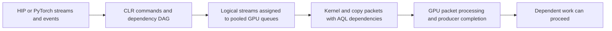

# Stream scheduling and native-wait admission

Current status, 2026-09-18: the minimal RC2 package passes correctness and removes
96.016% of waiter excess, but fails the unchanged microbenchmark performance
screens. Repeated graph expert losses reach 9.18% versus the earlier diagnostic.
The final new-byte HiSparse bridge is held. The generic entry repair is a
source-supported suspect; its entire cost has not yet been causally isolated.
See [RC2 comparison](benchmarks/dispatch_cost/RC2_MICRO_BRIDGE_RESULTS.md).

The selected architecture uses strict native admission at 24 unread producer
kernels and cached stable node-count placement with the original enqueue order.
Actual-enqueue stream tails and launch-entry dependencies remain required for
correctness. Original dependency packets, physical-queue guards, signal ABI/value
checks and retirement checks stay intact. Both optimization flags default off.

The **earlier d3 diagnostic**, which lacked the generic entry repair, reached
15.23–15.26 ms/token on HiSparse C1 prefetch-on (about 15.4% faster than guarded256)
and 17.95–17.98 ms/token on C4 (about 10% faster). Prefetch-off was effectively
neutral. Those numbers were within 2.3–2.4% and about 1% of the separate historical
bests, respectively. They do not qualify the corrected RC2 bytes or justify using
the old incomplete synchronization. No production package is qualified yet.

Three subsequent, reviewed same-byte micro diagnostics preserve the entry edge:
[lazy submission](benchmarks/dispatch_cost/ENTRY_LAZY_RESULTS.md),
[shared CPU retirement](benchmarks/dispatch_cost/ENTRY_BATCH_RESULTS.md), and
[kernel-only release deferral](benchmarks/dispatch_cost/ENTRY_ACQUIRE_RESULTS.md).
None resolves the residual losses. The latest still removes 95.86% of waiter
excess but loses 2.20% to stock on small-KV gather and 3.94% on two-stream experts.
Host completion measurements show those losses too, so GPU timestamp undercount
alone is insufficient as an explanation. The target remains unchanged
HIP/PyTorch APIs and retained application code on ROCm 7.2.4 / gfx950.

A subsequent [completed-start diagnostic](benchmarks/dispatch_cost/ENTRY_SEALED_RESULTS.md)
keeps runtime bytes and graph bodies fixed. Completing the begin event before launch
reduces the KV relative host penalty from 3.16% to 0.08% versus stock, while expert
penalties persist. This points to frontier/scheduling state, not a sufficient runtime
fix. The subsequent [untimed readiness observations](benchmarks/dispatch_cost/ENTRY_FRONTIER_RESULTS.md)
find 0/256 original frontiers ready and 256/256 completed-start controls ready, all
with pending CPU status. A completed-frontier shortcut has no observed opportunity
at this sampled point. The next architecture review concerns pending entry
dependencies, while preserving their full synchronization contract.

A narrowly scoped [entry-native prewait diagnostic](benchmarks/dispatch_cost/ENTRY_NATIVE_RESULTS.md)
then tested the pending-entry mechanism directly. It worsened 14 cells by more than
2% versus the identical-byte switch-off control, with no corresponding completed-start
losses above 2%. The policy is rejected. Long-wait excess removal remained 95.80%;
short pending dependencies still require cost admission.

The subsequent [first-batch dependency diagnostic](benchmarks/dispatch_cost/ENTRY_FUSED_RESULTS.md)
passed 240 correctness/failure checks and all dependency proofs. Against same-byte
lazy markers it improves small KV by1.20%, small four-stream experts by2.37%,
and large four-stream experts by3.15%, with no aggregate >2% GPU/host elapsed-time loss.
Waiter overhead removal remains95.83%. This is a useful architectural direction,
but the two-stream expert case still loses3.42% to stock and four expert targets
lose4.37–5.83% to historical d3. Source/package qualification and the model bridge
remain held. Preserve the required dependency while isolating its residual cost.
The [first-kernel release discriminator](benchmarks/dispatch_cost/ENTRY_SCOPE_RESULTS.md)
then preserved captured AGENT release while retaining SYSTEM acquire. All192
correctness/failure checks and exact scope proofs passed, but target effects
were only-0.36% to+0.63%. Do not add that change. WaitingSignal already skips
completed hardware dependencies at consumption; another ready-signal shortcut
would duplicate existing behavior.
The [immutable fused completed-start control](benchmarks/dispatch_cost/ENTRY_FUSED_SEALED_RESULTS.md)
then reduces the two-stream expert host loss versus stock from3.79% to1.61%
and KV from+1.30% to-0.13%. Sealed host losses above2% are zero versus stock
and one(2.11%) versus d3. This supports incoming-event-state sensitivity, but
sealing also changes host/GPU overlap and baseline times. It is not a qualification
waiver or proof of pure AQL-wait cost. The remaining useful observation is actual
wait emission at dependency consumption, later than51871's predecessor snapshot.
The [consumption observer](benchmarks/dispatch_cost/ENTRY_CONSUME_RESULTS.md)
finds185/192 expert and80/80 KV original-start dependencies selected and emitted
as entry-containing AQL barriers; completed-start controls emit0/272. All queues
are physically distinct and CPU waits are off. This establishes submission,
not GPU stall duration. A bounded CPU-poll diagnostic requires an explicit CPU
cost limit and normal GPU fallback; no benefit is inferred from these counts.
The [bounded CPU-poll diagnostic](benchmarks/dispatch_cost/ENTRY_POLL_RESULTS.md)
then passed192 correctness/failure checks but stopped at its planned mechanism
gate: all40 KV polls and47/48 expert polls exhausted1000ns while still requiring
a GPU wait. The sole expert completion was observed at1000ns. No performance
timing ran. Reject this candidate; preserve the gate instead of lengthening
the poll or interpreting instrumented counters as a speedup.

## Stock architecture

A stream orders its work; events introduce cross-stream dependencies. Different
logical streams do not guarantee distinct physical queues or concurrent execution.
CLR uses completion signals and AQL dependency packets to preserve signal conditions,
memory ordering and completion notification. A queue read index measures packet
progress, not a kernel's remaining execution time.

For captured graphs, the segmented scheduler partitions the DAG, groups segments
by dependency level, and assigns streams round-robin within each level. It enqueues
segments, inserts cross-stream dependency markers, then joins stream endpoints back
to the launch stream. Segments supply completion signals and CPU batch-retirement
boundaries. The stock classic fallback applies to at least 16 segments averaging
fewer than 8 nodes. Thus captured graphs with similar application intent can follow
different scheduler paths. Our grouped4 fixture follows that fallback; grouped25
exercises the segmented policy.

Queue pooling is another independent concern. The earlier four-expert test used
only three physical queues. The bounded spare-stream correction already in v9
repairs that collision case; it is distinct from the new admission/placement choice.

## What changes, and why

**Native admission.** Our optional path prepends a vendor packet containing PM4
`WAIT_REG_MEM` on the producer signal, then retains the original AQL dependency.
It changes where waiting occurs; it does not replace the synchronization contract.
The added packet, instruction-storage retirement and consumer handoff have costs.
The correct optimization target is the critical-path latency of the whole DAG:

`producer interference avoided > added handoff + packet/retirement cost`.

Released v9 admits this prewait only with a distinct tracked physical producer
queue and at least 256 recorded producer kernels still unread. History records
actual kernel positions, not total packet span; pending cross-queue dependencies
and engine transitions reset independent-segment history. Unknown metadata or
unavailable nonblocking queue lookup falls back to AQL. The candidate lowers only
the cost threshold to 24. It retains all correctness and physical eligibility rules.
Dispatch count is an empirical cost heuristic, not proof of remaining GPU work.

**Graph placement.** The candidate prepares a separate cached assignment order at
graph scheduling: descending segment node count, stable baseline ties. Enqueue order
stays unchanged. Placement can change queue serialization, overlap and producer
history without changing the graph dependencies. Node count is a cheap heuristic;
it does not model kernel duration, resource saturation or true critical-path length.
No sorting or priority-vector allocation occurs on replay.

**Actual stream tails.** Greatest dependency level does not identify the last
submission when independent segments share a level and logical stream. Placement
exposed premature completion from that old reconstruction. Track the actual last
enqueued command per logical stream instead, preserving per-segment ownership and
original dependencies. This is an unconditional correctness fix, independent of
whether the placement optimization ships. It is already pushed in PR1.

**Launch entry.** Qualification exposed a separate stock segmented-path defect:
independent side roots could run before preceding launch-stream initialization,
then have their results overwritten. The classic path already forks that
predecessor. The generic repair retains the launch frontier before graph submission
and emits ordinary markers to distinct logical side-root streams, preserving
external-copy cache/fence scope. Single-root/all-launch graphs avoid the fork.
Stock, diagnostic and the first minimal candidate reproduced the error; the
corrected candidate passes asynchronous entry and lifecycle checks. This required
repair adds work in multi-root cases, so its cost must be included in the bridge.

No kernel-driver or firmware replacement is required for this CLR overlay. The
precise lower-level cause of the original waiter interference and short-join
handoff cost remains unproved; do not attribute every stock wait to a particular
shader or infer firmware behavior from timings alone.

## Tradeoffs resolved by experiments

| Candidate | Evidence | Decision |
|---|---|---|
| Unconditional cost bypass | Queued two-/four-stream controls regress roughly 88%/74% | Reject |
| Strict admission24 | About 7% C1 prefetch-on gain; off neutral; held-out admission64 behaves as the proxy predicted | Retain |
| Enqueue reordering alone | Near neutral on grouped25 | Do not include |
| Successor-depth placement | Roughly 0.4% grouped loss, repeated across six rounds | Reject |
| Node-count placement alone | Grouped25 improves roughly 4–5% in two allocations; C1 adds9%, C4 adds6.2% | Retain as empirical heuristic |
| Placement plus enqueue reordering | Same maps as legacy, but mixed-workload timing sensitivity remains | Prefer placement alone |
| Launch-stream-role prewait suppression | Grouped micro regressions around 5%, despite earlier model benefit | Reject global rule |
| Marker omission | Model median effects dominated by retained variable trials; causal benefit unresolved | Do not include |
| Actual-enqueue completion tails | Old bytes fail with native waits off and on; corrected completion/lifecycle checks pass | Keep independently |
| Lazy entry submission | One target improves 2.45%, stock losses remain | Insufficient |
| Shared entry CPU retirement | Five target effects range from -0.51% to +0.08% | Do not select |
| Kernel-only entry release deferral | No target reaches 2% gain; stock losses remain, waiter removal 95.86% | Do not select |
| Graph-entry native cost override | 14 same-byte losses >2%; b16/two-stream expert +15.91%; sealed controls neutral | Reject |
| First-batch dependency integration | No >2% same-byte GPU/host elapsed loss; KV -1.20%, balanced four-stream experts -2.37/-3.15%; residual stock/d3 losses remain | Retain as useful diagnostic; insufficient |
| First-entry CPU poll, 1000 ns cap | KV 0/40 within-budget completions; experts 1/48; planned gate stops before timing | Reject; no timing or longer-budget retry |

Streams help when independent work leaves complementary hardware capacity available.
They can lose when branches saturate the same compute, bandwidth or cache resources,
or when repeated joins cost more than overlap saves. In the latest fixed-work
attention case, two streams take 211.63 us versus 355.15 us serial (about 1.68x);
the candidate runtime is nearly neutral relative to stock on that case. Small
transfers and producer-consumer boundaries are tested separately from large-copy
throughput. More streams or a larger overlap percentage is not itself success.

## What is established and what is not

The corrected placement factorial isolates assignment from submission order and
repeats the grouped gain. It establishes placement sufficiency for that fixture;
fewer aggregate native emissions do not establish the mechanism of the saving.
See [placement/order evidence](benchmarks/dispatch_cost/GRAPH_PLACEMENT_RESULTS.md).

Broad holdouts cover queued chains, fanout caps4/8, grouped4, small-KV attention-fetch,
H2D/D2H pipelines, fixed-work attention and the original waiter. Initial noisy
attention losses did not recur in an independent unchanged allocation. All trials
remain retained. These broad cases have no changed placement positions, so they
extend admission/overhead/fallback coverage rather than active-reassignment topology
coverage. See [complete holdouts and limits](benchmarks/dispatch_cost/GRAPH_TAIL_HOLDOUT_RESULTS.md).

C1 used six separately started residents, forward/reverse order, three retained
on/off requests per resident, exact libraries and six-worker control/map audits.
The 36 request means are nested observations, not 36 independent runtime starts.
Order balances linear drift, but nonlinear middle-of-run effects can favor both
placement residents. The per-block gain/off bounds are screening gates, not
confidence bounds. The historical best is a separate comparison cohort. See
[all C1 trials and frozen predictions](benchmarks/dispatch_cost/C1_PLACEMENT_RESULTS.md).

Exact-byte completion tests, event/queue lifecycle checks and PyTorch event/graph
checks passed. Child-graph tests cover the implementation's internally single-stream
path; they do not prove nested cross-stream behavior. Multi-device graph assignment
has a known preexisting limitation that reordering can expose. Production placement
must be restricted to qualified single-device graphs unless that path is separately
fixed and qualified. See [completion coverage](benchmarks/graph_completion/README.md).

## Productionization and remaining gates

1. Natural-generation screening passed 12/12 retained long-context probes on
   admission24 and placement24, prefetch on/off, trace0. An untimed trace verifies
   physical launch/side placement on all four ranks. Its planned exact cross-resident
   graph match failed because captures differ; the accepted proof is narrower and
   does not explain the magnitude of the C1 gain. See [model checks and limits](benchmarks/dispatch_cost/C1_MODEL_CHECKS.md).
2. C4 passed all frozen screens across36 retained trials and36 identities/maps;
   downloaded raw-data audit matched exactly. The corrected harness waits for
   ordinary startup warmup to finish before controlled requests. See [C4 results
   and node-context limits](benchmarks/dispatch_cost/C4_PLACEMENT_RESULTS.md).
3. Port only the selected changes into a minimal implementation: cached stable
   assignment, baseline enqueue order, strict admission24, single-device qualification
   boundary, device-change invalidation and unconditional actual tails. The prepared
   source invalidates cached eligibility even when a parameter setter subsequently
   fails; ordinary same-device updates preserve it. Remove rejected diagnostics. Do not
   change history capacity, packet alignment/retirement or signal eligibility.
   Removing diagnostics also removes host work and an unused instruction word;
   those compiled differences require the new-byte performance bridge.
4. The corrected minimal HIP library has built and passed84 one-GPU processes
   plus two two-device processes:2,560 PyTorch rows,384 lifecycle rows,576 terminal
   rows,96 entry rows and4 device-invalidation rows. Its exact-byte performance
   bridge completed and failed the frozen loss screens. Preserve this result and
   isolate the remaining cost before selecting another minimal candidate. Any
   changed candidate needs exact-byte correctness, microbenchmark qualification
   and final model confirmation. Only then package and qualify an opt-in HIP/HSA
   overlay with stock rollback.

The generic tail fix is in PR1 commit b36e37b, and the generic entry repair is
commit d862ffe. The current PR source now includes the minimal opt-in admission24
and flat single-device placement policy. Corrected qualification package
`marlowe-hip-7.2.4-placement-rc2` is HIP986f1c50 / HSA b8cdfe; the earlier measured
`graph-tail-diagnostic1` package remains HIPd3b22a. The minimal package remains
unqualified for production after its failed performance bridge. The release lock
is unchanged. The latest diagnostics remain isolated from the proposed production
source; none has been promoted.

Source: [admission policy](NATIVE_WAIT_POLICY.md),
[wait and packet submission](../../rocclr/device/rocm/rocvirtual.cpp),
[history metadata](../../rocclr/device/rocm/rocvirtual.hpp),
[graph scheduler](../../hipamd/src/hip_graph_internal.cpp),
[command batching](../../rocclr/platform/command.cpp).
Stock source: `fe5035afc8713dfc6adedd3c00c4306c93a160f8`; diagnostic base: `cab5670`.
The [initial Fable review](STREAM_WAIT_REVIEW.md) and linked experiment reports retain
rejected alternatives and earlier contradictory/noisy results. Later independent
Codex xhigh reviews support this bounded architecture and its stated limits.
