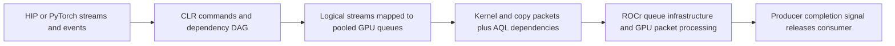

# Stream scheduling and native-wait admission

Design proposal, 2026-09-18. Scope: ROCm 7.2.4 / gfx950, unchanged HIP/PyTorch APIs.
**Recommendation after Fable review:** retain guarded admission for ordinary event
waits; first separate producer dispatch pressure, blocking time at GPU arrival and
consumer handoff cost. Use graph roles as measurement metadata before making them
admission rules. See [the review and corrections](STREAM_WAIT_REVIEW.md).
Treat scheduling, wait admission, and completion-marker removal as independent
changes. Unconditional bypass is a diagnostic, not the target architecture.

## 1. Stock architecture and our change

A stream orders its own work; events express cross-stream dependencies. Different
logical streams do not guarantee different physical queues or concurrent execution.
CLR carries producer completion signals to consumer AQL Barrier-AND/Barrier-Value
packets. The original dependency path supplies signal conditions, memory ordering,
and completion notification. A queue read index measures packet progress, not a
kernel's remaining execution time. [AMD's AQL reference](https://rocm.docs.amd.com/projects/HIP/en/docs-6.1.5/doxygen/html/group__aql.html)
and [barrier-value definition](https://rocm.docs.amd.com/projects/HIP/en/docs-6.3.3/doxygen/html/structhsa__amd__barrier__value__packet__t.html)
describe the packet semantics; the pinned local source is authoritative for this build.

For captured graphs, CLR partitions the DAG into segments, visits dependency levels,
and assigns segments to streams round-robin within a level. Cross-stream edges get
wait markers; segment completion commands provide signals, CPU submission-batch
retirement and profiling; a final join brings work back to the launch stream.
Stock queue pooling can collide: our expert trace showed four independent branches
using only three physical queues. The bounded spare-stream fix repairs that case;
it is separate from the wait policy and is already in the v9 source.

Our native path prepends a vendor AQL packet containing a PM4 `WAIT_REG_MEM` on the
producer signal, **then keeps the original AQL dependency**. It changes where/how
waiting happens without replacing the full synchronization contract. It adds
packet processing, instruction-storage retirement and a consumer handoff. No
kernel driver or firmware replacement is needed for the present CLR overlay.
The exact lower-level reason for the original waiter interference and short-join
handoff cost is not proven; do not assume every stock wait runs a particular shader.

V9 admits that extra prewait only with a distinct tracked physical producer queue
and at least 256 recorded producer kernels still unread. It records actual kernel
positions, not packet span; pending cross-queue dependencies and engine transitions
reset independent-segment history. Unknown metadata and unavailable queue lookups
fall back to AQL. This protects short chains but is a **cost heuristic**, not a
correctness rule. A long single kernel, fragmented producer, or forwarded event can
have expensive remaining work without satisfying it. Conversely, host backlog does
not prove a wait will still be long when the GPU reaches it.

Source: [admission policy](NATIVE_WAIT_POLICY.md),
[CLR wait and packet submission](../../rocclr/device/rocm/rocvirtual.cpp),
[history metadata](../../rocclr/device/rocm/rocvirtual.hpp),
[graph scheduler](../../hipamd/src/hip_graph_internal.cpp),
[CPU command batching](../../rocclr/platform/command.cpp).
Stock comparison source: `fe5035afc8713dfc6adedd3c00c4306c93a160f8`;
released overlay source: `cab5670a350678f2b0a6feb388fcbbca56c426a1`.

## 2. What the evidence supports

Times below are milliseconds, lower is better. Latest common micro matrix is
job 50081: three process rounds, all rows retained. Both diagnostic columns use
ordering and sidewait selection; guarded keeps admission and markers, while the
combined diagnostic bypasses admission and enables marker omission.

| Microbenchmark | Stock | Guarded | Combined diagnostic | Interpretation |
|---|---:|---:|---:|---|
| Grouped prefetch, 4 kernels/layer, 32 layers | 8.932 | 8.926 | 9.522 | Frequent short boundaries favor guarded waits |
| Grouped prefetch, 25 kernels/layer, 32 layers | 11.566 | 11.649 | 10.821 | A longer producer segment changes the tradeoff |
| Four expert streams, balanced b16 | 0.2313 | 0.1515 | 0.1607 | Queue separation helps; bypass gives some gain back |
| Four expert streams, balanced b64 | 0.1165 | 0.0957 | 0.1063 | Same pattern |
| Four expert streams, skewed b64 | 0.1937 | 0.1637 | 0.1669 | Same pattern; residual is smaller |

These columns bundle controls; causal claims come from the ablations below.
“25 kernels” is a workload description, not a proposed new threshold. Splitting
also adds launches, intermediate traffic and reductions, so equal arithmetic alone
does not isolate packet count.

- **Original pending-wait/fanout:** about 96% of added waiter overhead was removed,
  not 96% of total execution. V9 queued fanout improves total latency 36–64%
  versus disabled while retaining short queued-attention neutrality.
- **Queued short fork/join:** bypass regresses two-/four-stream controls about
  88%/74%. Earlier timelines showed overlap disappearing at repeated boundaries;
  extra streams do not fix an expensive join. Graph-only policies cannot fix eager waits.
- **HiSparse C1 prefetch, job 49875:** same bytes, guarded/unordered 17.398;
  bypass/unordered 16.528; guarded/ordered 17.003; bypass/ordered 15.335.
  Combined recovery is 2.064; interaction is 0.798. “Long-path ordering” here is
  actually stable sorting by segment node count, not measured critical-path duration.
- **Sidewait selection, job 49988:** disabling optional prewaits on launch-stream
  interior graph markers saves 0.177 (15.290 → 15.113) on identical bytes.
  It repairs several expert regressions but does not eliminate them. This is a
  logical-stream role test; it is not proof of a universal physical-queue rule.
- **Marker omission:** job 50081 passed 13,680 timing correctness rows and separate
  traces; paired job 50100 suggests only ~0.021/0.025 extra graph saving after
  subtracting eager-control shifts at 32/64 layers. That adjustment is descriptive.
  Historical c82 reached 14.898 ms/token; its 0.216 difference from 15.113 is a
  cross-run residual, not an established marker effect.
- **Hardware overlap controls:** sparse pinned-host KV gather overlapped attention,
  yet the small-copy pipeline was almost neutral; concurrent matrix/scan kernels
  became slower individually. Bandwidth/cache/compute contention can consume the
  overlap gain. Extra streams need not help when both branches compete for the same saturated resource.
  Wide/batched kernels sometimes beat separate streams; that is a geometry change.

The whole admission gate was bypassed: these experiments do **not** isolate the
256-count test from metadata availability, queue lookup or read-index checks.
Model marker job 50108 completed with all nine identity/control audits passing:
previous / new-off / new-on medians **15.276 / 22.881 / 15.097**. Two off trials and
one on trial contain large retained intervals. The raw 7.785 ms off/on difference
is not a stable marker-effect estimate; neither discard those trials nor use the
fastest trial as the result. This leaves marker attribution unresolved.
All slow trials remain included. No multi-second-gap investigation is part of this plan.
Evidence: [grouped/model ablations](benchmarks/llm_streams/GROUPED_RESULTS.md),
[overlap and queue-collision results](benchmarks/llm_streams/RESULTS.md),
[queued holdouts](benchmarks/queued_streams/RESULTS.md),
[original wait and large-kernel tests](QUALIFICATION.md).

## 3. Architectural principle

Minimize **the critical-path cost of the whole dependency DAG**, not the number of
waits admitted or the overlap percentage. A native prewait is attractive when:

`producer interference avoided > extra consumer handoff + packet/retirement cost`,
counting costs exposed on the critical path rather than adding every stage duration.

Neither duration nor dispatch count alone is established as sufficient: our earlier
large-kernel fork/join case also regressed under native waits. The tradeoff depends
on when the consumer reaches the wait, remaining producer work,
physical queue/engine assignment and which branch determines completion. Kernel
count, logical stream name and total graph size are incomplete proxies.

Keep three layers explicit:

1. **Dependency correctness and eligibility:** original AQL conditions/fences, signal
   generation ownership and final completion stay invariant. Keep physical-queue,
   supported-signal/ABI and nonblocking fallback checks outside cost-admission knobs.
   The historical bypass skips same-queue/unknown-producer checks too; it is not the
   implementation template for a new policy.
2. **Graph schedule:** map independent work to distinct available queues and schedule
   ready work using estimated critical-path cost. Never add streams just to raise a count.
3. **Optional wait optimization:** attach bounded metadata to a specific dependency
   generation; decide whether its prewait pays. Unknown cases retain guarded behavior.

Metadata should distinguish a branch-start dependency, internal pipeline handoff,
fan-in join and final graph completion; identify producer/consumer physical queues
and engine type; and describe only work before the relevant completion event.
Refresh mappings on replay/queue changes; invalidate plans on graph updates.
Do not extend history across an arbitrary wait merely to make a threshold pass.
Pinned-host gather is GPU compute, whereas an actual SDMA transfer is a different
engine: “copy stream” is not enough information to choose the wait policy.

The [microbenchmark mismatch note](STREAM_WAIT_MICRO_GAPS.md) records our independent
hypotheses. Fable's review moves the count/duration/readiness test ahead of the
direct-versus-relayed test; both precede choosing a graph-role classifier.

## 4. Ranked candidates

| Priority / candidate | Concrete change | Why promising / main risk | Decisive test |
|---|---|---|---|
| **1. Measurement-gated graph admission** | Keep v9 eager/unknown behavior. Partition graph edges by role, physical queue and producer provenance for attribution. Implement selective exceptions only after measurements distinguish beneficial waits from short joins; roles alone do not grant admission. | Admission causality is measured, but the classifier is unresolved. Host-time history can differ from work remaining at GPU wait entry; experts and prefetch can share a role. | First separate launch count, work duration and readiness; then direct/relayed completion. Require prefetch gains and expert/queued holdouts together. |
| **2. Schedule and simplify the graph first** | Preserve collision avoidance; rank ready segments by downstream critical-path estimate, using duration estimates only when available. Prove redundant same-queue/transitive waits before removing them. Treat marker omission separately. | Avoids serializing useful work regardless of wait backend. Node count is cheap but weak; concurrent resource contention can reverse a duration-based choice. Removing markers can alter CPU lifetime/profiling. | Two-/four-stream experts, short and long prefetch, saturated-resource controls; same-byte ordering on/off with both admission modes. |
| **3. Repeated-graph cost policy** | Cache per-edge decisions using bounded, sampled event timing or existing profile data; consider remaining producer time and observed fork/join cost. Freeze decisions during measurement, add hysteresis and conservative fallback. | Addresses long kernels and forwarded events that count-based policy misses. Sampling perturbs scheduling; stale timings and collection overhead can erase gains. | Train on one shape, test unseen lengths, occupancy and queue depth. Charge sampling overhead; reject oscillation or a model-specific whitelist. |
| **4. Lower-level native AQL wait path** | Investigate ROCr/packet-processor support for efficient queue-local waiting that preserves full signal/fence/notification semantics without our extra prewait packet. | Cleanest eventual abstraction if short handoff is intrinsic to the current two-packet path. Firmware/queue-scheduling behavior and platform support are unproven. | Tiny ready/pending waits, fanout, short chains and large-kernel fork/join; inspect the packet path only if the runtime candidates cannot meet both goals. |

The separating tests now reject a global threshold 8: the 16-launch captured
attention holdout regresses 6.12%. Threshold 32 is close to guarded in that matrix,
but has no demonstrated model recovery. Early-arrival tests show a single native
prewait can recover about 15 µs of producer execution while adding about 30 µs to
handoff, making total execution worse. Duplicate suppression removes a confirmed
second packet but leaves the holdout 5.63% slower than guarded. The next decision
was therefore the packet path. That diagnostic now shows intervals1/4/16 and
ordering leave the penalty; stable-zero removes both the penalty and the producer
benefit. A real-attention256-launch positive control supports dispatch pressure
as a useful predictor in this fixture. The intermediate-count and existing LLM
holdouts now favor threshold 24: it protects the short joins and improves grouped
prefetch while retaining the original waiter/fanout benefit. Exact-byte lifecycle
and PyTorch checks passed. First matched C1 calibration now improves prefetch-on 17.971→16.759 ms/token
(6.75%) at threshold24, with prefetch-off nearly unchanged (15.042→15.053). Each
mode had one resident in a fixed order. A fresh allocation reversed that relative
order and confirmed a 7.03% prefetch-on gain (18.035→16.766 ms/token), with
prefetch-off +0.08%. The held-out threshold64 prediction also passed: its
prefetch-on result stayed near guarded and was 7.24% slower than threshold24.
The unchanged micro now predicts one held-out admission intervention in this
workload family; it is not a universal model proxy or an exact scaling model.
Current C1 remains 12.54% above the separate historical 14.897670 ms/token best.
Next test guard256/24 × default/(node-count ordering + interior marker policy)
on identical new bytes, with prior-byte bridges and unchanged micro holdouts.
No marker omission or unrestricted bypass. This is not production qualification.
See [reverse-order confirmation](benchmarks/dispatch_cost/C1_CONFIRM_RESULTS.md)
and [C1 calibration and its audit correction](benchmarks/dispatch_cost/C1_RESULTS.md). See [the admission holdouts](benchmarks/dispatch_cost/ADMISSION_RESULTS.md). See [dispatch evidence](benchmarks/dispatch_cost/RESULTS.md),
[duplicate suppression](benchmarks/dispatch_cost/DEDUP_RESULTS.md), and
[packet/arrival evidence](benchmarks/dispatch_cost/PACKET_RESULTS.md).
The combined graph/admission micro screen now improves grouped25 prefetch-on
by 8.2%/7.3% over guarded at 32/64 layers, while preserving 96.1% of original
waiter-excess removal and passing exact-byte PyTorch/lifecycle checks. An
independent mixed-workload confirmation also exposes a repeatable 2.6% loss
versus admission24 for parallel matrix-plus-KV graphs (about 1% versus stock).
Global node-count ordering is therefore still a candidate with a tradeoff.
The same-byte LONGPATH/SIDEWAIT split must resolve that attribution before
advancing the bundled C1 grid. These results also require balancing the actual
factorial cells; rotating unrelated baseline positions did not counterbalance
those interventions. See [the graph policy evidence](benchmarks/dispatch_cost/GRAPH_POLICY_RESULTS.md).

Do not deploy unconditional bypass; **a role classifier is not yet selected**.
Candidate 2 can improve scheduling independently. Before candidate 3, validate
completion-observation lag and sampling overhead; CPU timestamps are not wait-entry times.

## 5. Bounded implementation and validation plan

1. **Identify the policy boundary:** retain 50108 as inconclusive for marker cost.
   Run the [count/duration/readiness experiment](STREAM_WAIT_REVIEW.md#revised-next-experiment)
   alongside a bounded untimed C1 admission census. Prioritize the direct/relayed
   completion test if the census points to lost provenance rather than count rejection. Count skip reasons, physical queues
   and signal generations separately from timing. Do not infer native packet cost
   from an already-ready-at-CPU control: its prewait may never be emitted.
2. **One prototype, one new decision:** select the admission variable from those
   results, not the benchmark name. Add it behind a default-off flag with physical
   eligibility retained. Keep markers and scheduling fixed; compare same-byte
   guarded/new controls, stock separately, and retain a rebuild control.
3. **Small separating matrix:** few-long versus many-short producer kernels at similar
   total work; early versus delayed consumer arrival; independent prefix versus repeated
   joins; 1/2/4 physical queues including shared-queue fallback; two-/four-stream experts;
   grouped 4/25-kernel prefetch; small KV gather/H2D/D2H with buffer reuse; occupied and
   bandwidth-contention controls. Include original waiter and queued fanout. Do not tune
   kernels to favor the policy. Reserve changed shapes as holdouts.
4. **Acceptance before another model grid:** preserve ~96% waiter-excess reduction;
   recover at least 80% of the same-run guarded→eligibility-preserving relaxed benefit in the many-kernel
   prefetch holdout; no known guarded-control regression >2% consistently across three
   paired rounds. Material noisy losses require another allocation, not filtering.
   Require output/dependency correctness, event reuse, queue sharing, graph updates,
   endpoint ties, profiling fallback and PyTorch event/graph checks on exact bytes.
   These are proposed gates, not guarantees of universal neutrality. The exact
   signal-value/ABI guards, nonblocking fallback and instruction retirement must remain.
5. **Then narrow model confirmation:** script-owned C1 prefetch-on/off TP4 runs, matched
   guarded/new/eligibility-preserving relaxed controls, three retained trials each.
   Record micro predictions before model runs; validate held-out interventions rather
   than claiming a proxy from one same-sign result. Aim to recover ≥80% of the
   eligible relaxed gain without sacrificing micro holdouts, while tracking the absolute
   historical best separately. Only afterward expand a good candidate to C4 and standard GLM. Keep the runtime independent of application tuning.

Ship a single coherent policy only after those gates, with an opt-in versioned
HIP/HSA overlay and stock rollback. Keep timing/debug harnesses outside the runtime
implementation. The current release lock and production qualification are unchanged.
