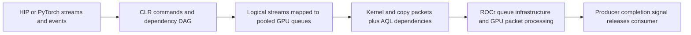

# Stream scheduling and native-wait admission

Design proposal, 2026-09-18. Scope: ROCm 7.2.4 / gfx950, unchanged HIP/PyTorch APIs.
**Recommendation:** retain guarded admission for ordinary event waits; develop a
separate graph policy that understands dependency roles and actual queue mapping.
Treat scheduling, wait admission, and completion-marker removal as independent
changes. Unconditional bypass is a diagnostic, not the target architecture.

## 1. Stock architecture and our change

A stream orders its own work; events express cross-stream dependencies. Different
logical streams do not guarantee different physical queues or concurrent execution.
CLR carries producer completion signals to consumer AQL Barrier-AND/Barrier-Value
packets. The original dependency path supplies signal conditions, memory ordering,
and completion notification. A queue read index measures packet progress, not a
kernel's remaining execution time. [AMD's AQL reference](https://rocm.docs.amd.com/projects/HIP/en/docs-6.1.5/doxygen/html/group__aql.html)
and [barrier-value definition](https://rocm.docs.amd.com/projects/HIP/en/docs-6.3.3/doxygen/html/structhsa__amd__barrier__value__packet__t.html)
describe the packet semantics; the pinned local source is authoritative for this build.

For captured graphs, CLR partitions the DAG into segments, visits dependency levels,
and assigns segments to streams round-robin within a level. Cross-stream edges get
wait markers; segment completion commands provide signals, CPU submission-batch
retirement and profiling; a final join brings work back to the launch stream.
Stock queue pooling can collide: our expert trace showed four independent branches
using only three physical queues. The bounded spare-stream fix repairs that case;
it is separate from the wait policy and is already in the v9 source.

Our native path prepends a vendor AQL packet containing a PM4 `WAIT_REG_MEM` on the
producer signal, **then keeps the original AQL dependency**. It changes where/how
waiting happens without replacing the full synchronization contract. It adds
packet processing, instruction-storage retirement and a consumer handoff. No
kernel driver or firmware replacement is needed for the present CLR overlay.
The exact lower-level reason for the original waiter interference and short-join
handoff cost is not proven; do not assume every stock wait runs a particular shader.

V9 admits that extra prewait only with a distinct tracked physical producer queue
and at least 256 recorded producer kernels still unread. It records actual kernel
positions, not packet span; pending cross-queue dependencies and engine transitions
reset independent-segment history. Unknown metadata and unavailable queue lookups
fall back to AQL. This protects short chains but is a **cost heuristic**, not a
correctness rule. A long single kernel, fragmented producer, or forwarded event can
have expensive remaining work without satisfying it. Conversely, host backlog does
not prove a wait will still be long when the GPU reaches it.

Source: [admission policy](NATIVE_WAIT_POLICY.md),
[CLR wait and packet submission](../../rocclr/device/rocm/rocvirtual.cpp),
[history metadata](../../rocclr/device/rocm/rocvirtual.hpp),
[graph scheduler](../../hipamd/src/hip_graph_internal.cpp),
[CPU command batching](../../rocclr/platform/command.cpp).
Stock comparison source: `fe5035afc8713dfc6adedd3c00c4306c93a160f8`;
released overlay source: `cab5670a350678f2b0a6feb388fcbbca56c426a1`.

## 2. What the evidence supports

Times below are milliseconds, lower is better. Latest common micro matrix is
job 50081: three process rounds, all rows retained. Both diagnostic columns use
ordering and sidewait selection; guarded keeps admission and markers, while the
combined diagnostic bypasses admission and enables marker omission.

| Microbenchmark | Stock | Guarded | Combined diagnostic | Interpretation |
|---|---:|---:|---:|---|
| Grouped prefetch, 4 kernels/layer, 32 layers | 8.932 | 8.926 | 9.522 | Frequent short boundaries favor guarded waits |
| Grouped prefetch, 25 kernels/layer, 32 layers | 11.566 | 11.649 | 10.821 | A longer producer segment changes the tradeoff |
| Four expert streams, balanced b16 | 0.2313 | 0.1515 | 0.1607 | Queue separation helps; bypass gives some gain back |
| Four expert streams, balanced b64 | 0.1165 | 0.0957 | 0.1063 | Same pattern |
| Four expert streams, skewed b64 | 0.1937 | 0.1637 | 0.1669 | Same pattern; residual is smaller |

These columns bundle controls; causal claims come from the ablations below.
“25 kernels” is a workload description, not a proposed new threshold. Splitting
also adds launches, intermediate traffic and reductions, so equal arithmetic alone
does not isolate packet count.

- **Original pending-wait/fanout:** about 96% of added waiter overhead was removed,
  not 96% of total execution. V9 queued fanout improves total latency 36–64%
  versus disabled while retaining short queued-attention neutrality.
- **Queued short fork/join:** bypass regresses two-/four-stream controls about
  88%/74%. Earlier timelines showed overlap disappearing at repeated boundaries;
  extra streams do not fix an expensive join. Graph-only policies cannot fix eager waits.
- **HiSparse C1 prefetch, job 49875:** same bytes, guarded/unordered 17.398;
  bypass/unordered 16.528; guarded/ordered 17.003; bypass/ordered 15.335.
  Combined recovery is 2.064; interaction is 0.798. “Long-path ordering” here is
  actually stable sorting by segment node count, not measured critical-path duration.
- **Sidewait selection, job 49988:** disabling optional prewaits on launch-stream
  interior graph markers saves 0.177 (15.290 → 15.113) on identical bytes.
  It repairs several expert regressions but does not eliminate them. This is a
  logical-stream role test; it is not proof of a universal physical-queue rule.
- **Marker omission:** job 50081 passed 13,680 timing correctness rows and separate
  traces; paired job 50100 suggests only ~0.021/0.025 extra graph saving after
  subtracting eager-control shifts at 32/64 layers. That adjustment is descriptive.
  Historical c82 reached 14.898 ms/token; its 0.216 difference from 15.113 is a
  cross-run residual, not an established marker effect.
- **Hardware overlap controls:** sparse pinned-host KV gather overlapped attention,
  yet the small-copy pipeline was almost neutral; concurrent matrix/scan kernels
  became slower individually. Bandwidth/cache/compute contention can consume the
  overlap gain. Extra streams need not help when both branches compete for the same saturated resource.
  Wide/batched kernels sometimes beat separate streams; that is a geometry change.

The whole admission gate was bypassed: these experiments do **not** isolate the
256-count test from metadata availability, queue lookup or read-index checks.
Model marker job 50108 completed with all nine identity/control audits passing:
previous / new-off / new-on medians **15.276 / 22.881 / 15.097**. Two off trials and
one on trial contain large retained intervals. The raw 7.785 ms off/on difference
is not a stable marker-effect estimate; neither discard those trials nor use the
fastest trial as the result. This leaves marker attribution unresolved.
All slow trials remain included. No multi-second-gap investigation is part of this plan.
Evidence: [grouped/model ablations](benchmarks/llm_streams/GROUPED_RESULTS.md),
[overlap and queue-collision results](benchmarks/llm_streams/RESULTS.md),
[queued holdouts](benchmarks/queued_streams/RESULTS.md),
[original wait and large-kernel tests](QUALIFICATION.md).

## 3. Architectural principle

Minimize **the critical-path cost of the whole dependency DAG**, not the number of
waits admitted or the overlap percentage. A native prewait is attractive when:

`producer interference avoided > extra consumer handoff + packet/retirement cost`,
counting costs exposed on the critical path rather than adding every stage duration.

That depends on when the consumer reaches the wait, remaining producer work,
physical queue/engine assignment and which branch determines completion. Kernel
count, logical stream name and total graph size are incomplete proxies.

Keep three layers explicit:

1. **Dependency correctness:** original AQL conditions/fences, signal generation
   ownership, producer-before-consumer ordering and final completion stay invariant.
2. **Graph schedule:** map independent work to distinct available queues and schedule
   ready work using estimated critical-path cost. Never add streams just to raise a count.
3. **Optional wait optimization:** attach bounded metadata to a specific dependency
   generation; decide whether its prewait pays. Unknown cases retain guarded behavior.

Metadata should distinguish a branch-start dependency, internal pipeline handoff,
fan-in join and final graph completion; identify producer/consumer physical queues
and engine type; and describe only work before the relevant completion event.
Refresh mappings on replay/queue changes; invalidate plans on graph updates.
Do not extend history across an arbitrary wait merely to make a threshold pass.
Pinned-host gather is GPU compute, whereas an actual SDMA transfer is a different
engine: “copy stream” is not enough information to choose the wait policy.

## 4. Ranked candidates

| Priority / candidate | Concrete change | Why promising / main risk | Decisive test |
|---|---|---|---|
| **1. Graph dependency-role admission** | Keep v9 guard for eager/unknown dependencies. In graphs, permit subthreshold native waits only on classified internal side-branch handoffs with distinct physical queues, a submitted producer and an independent producer prefix. Keep short fork/join and final joins guarded initially. Bound admissions per dependency frontier, not per whole graph. | Builds on the measured sidewait benefit and scheduling interaction. Expert branches may look similar to prefetch; role alone may fail. Producer-prefix cost must distinguish them. | C1-like grouped prefetch and balanced/skew experts in the same binary. Reject if expert/queued regressions return or long-producer benefit disappears. |
| **2. Schedule and simplify the graph first** | Preserve collision avoidance; rank ready segments by downstream critical-path estimate, using duration estimates only when available. Prove redundant same-queue/transitive waits before removing them. Treat marker omission separately. | Avoids serializing useful work regardless of wait backend. Node count is cheap but weak; concurrent resource contention can reverse a duration-based choice. Removing markers can alter CPU lifetime/profiling. | Two-/four-stream experts, short and long prefetch, saturated-resource controls; same-byte ordering on/off with both admission modes. |
| **3. Repeated-graph cost policy** | Cache per-edge decisions using bounded, sampled event timing or existing profile data; consider remaining producer time and observed fork/join cost. Freeze decisions during measurement, add hysteresis and conservative fallback. | Addresses long kernels and forwarded events that count-based policy misses. Sampling perturbs scheduling; stale timings and collection overhead can erase gains. | Train on one shape, test unseen lengths, occupancy and queue depth. Charge sampling overhead; reject oscillation or a model-specific whitelist. |
| **4. Lower-level native AQL wait path** | Investigate ROCr/packet-processor support for efficient queue-local waiting that preserves full signal/fence/notification semantics without our extra prewait packet. | Cleanest eventual abstraction if short handoff is intrinsic to the current two-packet path. Firmware/queue-scheduling behavior and platform support are unproven. | Tiny ready/pending waits, fanout, short chains and large-kernel fork/join; inspect the packet path only if the runtime candidates cannot meet both goals. |

Do not simply lower 256 globally or deploy unconditional bypass. Both ignore wait
readiness at execution and repeat a known failure mode. Candidate 1 is the first
experiment, **not a claim that we already know the right classifier**. Candidate 2
can improve it independently; candidate 3 is justified only if static metadata fails.

## 5. Bounded implementation and validation plan

1. **Identify the policy boundary:** retain completed 50108 as inconclusive for
   marker cost; require replication before claiming a marker win. Separately count admission rejection reasons and dependency roles in one diagnostic
   micro pass, with queue identity and signal generation. No stderr tracing during timings.
   This checks whether the missing C1-like opportunities really are subthreshold
   internal handoffs before implementing candidate 1's exception.
2. **One prototype, one new decision:** add dependency metadata and candidate 1 behind
   a default-off flag. Keep marker removal off and hold scheduling fixed. Compare stock,
   guarded and new policy on identical candidate bytes; retain a rebuild control.
3. **Small separating matrix:** few-long versus many-short producer kernels at similar
   total work; early versus delayed consumer arrival; independent prefix versus repeated
   joins; 1/2/4 physical queues including shared-queue fallback; two-/four-stream experts;
   grouped 4/25-kernel prefetch; small KV gather/H2D/D2H with buffer reuse; occupied and
   bandwidth-contention controls. Include original waiter and queued fanout. Do not tune
   kernels to favor the policy. Reserve changed shapes as holdouts.
4. **Acceptance before another model grid:** preserve ~96% waiter-excess reduction;
   recover at least 80% of the same-run guarded→bypass benefit in the many-kernel
   prefetch holdout; no known guarded-control regression >2% consistently across three
   paired rounds. Material noisy losses require another allocation, not filtering.
   Require output/dependency correctness, event reuse, queue sharing, graph updates,
   endpoint ties, profiling fallback and PyTorch event/graph checks on exact bytes.
   These are proposed gates, not guarantees of universal neutrality. The exact
   signal-value/ABI guards, nonblocking fallback and instruction retirement must remain.
5. **Then narrow model confirmation:** peer-owned C1 prefetch-on TP4 on node2, matched
   guarded/new/bypass controls, three retained trials each. Aim to recover ≥80% of the
   guarded→bypass gain without sacrificing micro holdouts. Only afterward expand to
   C1 prefetch-off, C4 and standard GLM. Keep the runtime independent of application tuning.

Ship a single coherent policy only after those gates, with an opt-in versioned
HIP/HSA overlay and stock rollback. Keep timing/debug harnesses outside the runtime
implementation. The current release lock and production qualification are unchanged.
