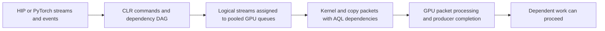

# Stream scheduling and native-wait admission

Current status, 2026-09-18: **no production package is qualified**. The new minimal
[fused RC1 candidate](benchmarks/graph_completion/FUSED_RC1_CHECKS.md) passes 120
single-GPU correctness processes and two two-device checks, including PyTorch.
Its [broad performance bridge](benchmarks/dispatch_cost/FUSED_RC1_PERFORMANCE.md)
removes95.772% of waiter excess but fails the original stock screens. Two >2%
new-versus-prior losses do not repeat above2% in one unchanged confirmation;
the two-stream expert stock loss persists at3.29%. Both allocations are retained
separately. The earlier minimal RC2 removed96.016% of waiter excess but also
failed the unchanged microbenchmark screens.
The best measured architectural
improvement is [fused first-batch entry](benchmarks/dispatch_cost/ENTRY_FUSED_RESULTS.md):
it retains95.83% waiter excess removal and improves small KV by1.20% and balanced
four-stream experts by2.37–3.15% relative to same-byte lazy markers. However,
two-stream experts still lose3.42% to stock, and four expert targets lose4.37–5.83%
to historical d3. Final qualification remains held. The [corrected-byte C1 bridge](benchmarks/graph_completion/FUSED_C1_RESULTS.md)
stays within 0.48% of historical d3 in both prefetch states and both matched
blocks. Prefetch-on is within 1.3–1.6% of the separate historical best. This
passes the model screens but cannot waive the microbenchmark failures. The
[C4 extension](benchmarks/graph_completion/FUSED_C4_RESULTS.md) also passes:
prefetch-on is 0.08–0.35% faster than d3, and off ranges from -0.23% to +0.04%.
It is within 0.66–0.72% of the separate historical prefetch-on best. No further
full-model rerun is needed without a new candidate or distinct unresolved concern.

The selected architecture uses strict native admission at24 unread producer
kernels and cached stable node-count placement with original enqueue order.
Actual-enqueue stream tails and launch-entry dependencies remain required for
correctness. Fusing a required entry dependency into its first captured kernel
batch is useful; it has not completed production qualification. Both shipping
optimization flags default off. The target remains unchanged HIP/PyTorch APIs
and retained application code on ROCm7.2.4/gfx950.

The **earlier d3 diagnostic**, which lacked the generic entry repair, reached
15.23–15.26ms/token on HiSparse C1 prefetch-on (about15.4% faster than guarded256)
and17.95–17.98ms/token on C4 (about10% faster). Prefetch-off was effectively neutral.
Those were within2.3–2.4% and about1% of the separate historical bests. They do not
qualify corrected bytes or justify recovering speed by removing synchronization.

The remaining microbenchmark penalty is sensitive to incoming-event state.
An [unchanged-byte completed-start control](benchmarks/dispatch_cost/ENTRY_FUSED_SEALED_RESULTS.md)
reduces the two-stream expert host loss versus stock from3.79% to1.61%, and KV
from+1.30% to-0.13%. Sealing also changes host/GPU overlap and baseline times;
this is not a qualification waiver or a measurement of pure GPU wait cost.
[Consumption observations](benchmarks/dispatch_cost/ENTRY_CONSUME_RESULTS.md)
find185/192 expert and80/80 KV original dependencies selected as GPU waits,
versus0/272 with completed starts. They measure submission, not GPU stall duration.

Two direct remedies did not resolve that penalty. A
[bounded CPU poll](benchmarks/dispatch_cost/ENTRY_POLL_RESULTS.md) passed192 checks
but stopped at its planned mechanism gate: all40 KV polls and47/48 expert polls
exhausted1000ns while still requiring a GPU wait. No timing ran. A
[single-packet barrier-value replacement](benchmarks/dispatch_cost/ENTRY_VALUE_RESULTS.md)
passed192 checks and actual-emission proofs, but target GPU effects ranged from
-1.01% to+1.94%; two-stream experts changed only-0.10%. Reject both additions.
The architecture must preserve the necessary dependency; further work should
address a distinct source of its latency instead of extending those parameter sweeps.

A [clean stock-source comparison](benchmarks/dispatch_cost/ENTRY_BASELINE_RESULTS.md)
now isolates the combined correctness-repair effect. Fresh stock plus only the
entry and actual-tail repairs is4.52% slower than fresh vanilla on two-stream
experts; fused is0.24% faster than repaired stock. Fused has no>2% GPU/host loss
against that correct comparator across172 expert/KV cells, but still loses3.44%
against installed stock on the two-stream case. Vanilla rebuild differences stay
below2% in every elapsed-time cell. This localizes the residual to work introduced
by the required repairs, without proving its cost unavoidable or waiving the
original stock screen. Four-stream gains against repaired stock include the entire
fused runtime stack, not entry fusion alone. Broader and model gates remain open.

## Stock architecture

A stream orders its work; events introduce cross-stream dependencies. Different
logical streams do not guarantee distinct physical queues or concurrent execution.
CLR uses completion signals and AQL dependency packets to preserve signal conditions,
memory ordering and completion notification. A queue read index measures packet
progress, not a kernel's remaining execution time.

For captured graphs, the segmented scheduler partitions the DAG, groups segments
by dependency level, and assigns streams round-robin within each level. It enqueues
segments, inserts cross-stream dependency markers, then joins stream endpoints back
to the launch stream. Segments supply completion signals and CPU batch-retirement
boundaries. The stock classic fallback applies to at least 16 segments averaging
fewer than 8 nodes. Thus captured graphs with similar application intent can follow
different scheduler paths. Our grouped4 fixture follows that fallback; grouped25
exercises the segmented policy.

Queue pooling is another independent concern. The earlier four-expert test used
only three physical queues. The bounded spare-stream correction already in v9
repairs that collision case; it is distinct from the new admission/placement choice.

## What changes, and why

**Native admission.** Our optional path prepends a vendor packet containing PM4
`WAIT_REG_MEM` on the producer signal, then retains the original AQL dependency.
It changes where waiting occurs; it does not replace the synchronization contract.
The added packet, instruction-storage retirement and consumer handoff have costs.
The correct optimization target is the critical-path latency of the whole DAG:

`producer interference avoided > added handoff + packet/retirement cost`.

Released v9 admits this prewait only with a distinct tracked physical producer
queue and at least 256 recorded producer kernels still unread. History records
actual kernel positions, not total packet span; pending cross-queue dependencies
and engine transitions reset independent-segment history. Unknown metadata or
unavailable nonblocking queue lookup falls back to AQL. The candidate lowers only
the cost threshold to 24. It retains all correctness and physical eligibility rules.
Dispatch count is an empirical cost heuristic, not proof of remaining GPU work.

**Graph placement.** The candidate prepares a separate cached assignment order at
graph scheduling: descending segment node count, stable baseline ties. Enqueue order
stays unchanged. Placement can change queue serialization, overlap and producer
history without changing the graph dependencies. Node count is a cheap heuristic;
it does not model kernel duration, resource saturation or true critical-path length.
No sorting or priority-vector allocation occurs on replay.

**Actual stream tails.** Greatest dependency level does not identify the last
submission when independent segments share a level and logical stream. Placement
exposed premature completion from that old reconstruction. Track the actual last
enqueued command per logical stream instead, preserving per-segment ownership and
original dependencies. This is an unconditional correctness fix, independent of
whether the placement optimization ships. It is already pushed in PR1.

**Launch entry.** Qualification exposed a separate stock segmented-path defect:
independent side roots could run before preceding launch-stream initialization,
then have their results overwritten. The classic path already forks that
predecessor. The generic repair retains the launch frontier before graph submission
and emits ordinary markers to distinct logical side-root streams, preserving
external-copy cache/fence scope. Single-root/all-launch graphs avoid the fork.
Stock, diagnostic and the first minimal candidate reproduced the error; the
corrected candidate passes asynchronous entry and lifecycle checks. This required
repair adds work in multi-root cases, so its cost must be included in the bridge.

No kernel-driver or firmware replacement is required for this CLR overlay. The
precise lower-level cause of the original waiter interference and short-join
handoff cost remains unproved; do not attribute every stock wait to a particular
shader or infer firmware behavior from timings alone.

## Tradeoffs resolved by experiments

| Candidate | Evidence | Decision |
|---|---|---|
| Unconditional cost bypass | Queued two-/four-stream controls regress roughly 88%/74% | Reject |
| Strict admission24 | About 7% C1 prefetch-on gain; off neutral; held-out admission64 behaves as the proxy predicted | Retain |
| Enqueue reordering alone | Near neutral on grouped25 | Do not include |
| Successor-depth placement | Roughly 0.4% grouped loss, repeated across six rounds | Reject |
| Node-count placement alone | Grouped25 improves roughly 4–5% in two allocations; C1 adds9%, C4 adds6.2% | Retain as empirical heuristic |
| Placement plus enqueue reordering | Same maps as legacy, but mixed-workload timing sensitivity remains | Prefer placement alone |
| Launch-stream-role prewait suppression | Grouped micro regressions around 5%, despite earlier model benefit | Reject global rule |
| Marker omission | Model median effects dominated by retained variable trials; causal benefit unresolved | Do not include |
| Actual-enqueue completion tails | Old bytes fail with native waits off and on; corrected completion/lifecycle checks pass | Keep independently |
| Lazy entry submission | One target improves 2.45%, stock losses remain | Insufficient |
| Shared entry CPU retirement | Five target effects range from -0.51% to +0.08% | Do not select |
| Kernel-only entry release deferral | No target reaches 2% gain; stock losses remain, waiter removal 95.86% | Do not select |
| Graph-entry native cost override | 14 same-byte losses >2%; b16/two-stream expert +15.91%; sealed controls neutral | Reject |
| First-batch dependency integration | No >2% same-byte GPU/host elapsed loss; KV -1.20%, balanced four-stream experts -2.37/-3.15%; residual stock/d3 losses remain | Retain as useful diagnostic; insufficient |
| First-entry CPU poll, 1000 ns cap | KV 0/40 within-budget completions; experts 1/48; planned gate stops before timing | Reject; no timing or longer-budget retry |
| Singleton entry barrier-value packet | Exact mechanism verified; GPU target changes -1.01% to +1.94%, two-stream -0.10% | Do not select; close representation branch |

Streams help when independent work leaves complementary hardware capacity available.
They can lose when branches saturate the same compute, bandwidth or cache resources,
or when repeated joins cost more than overlap saves. In the latest fixed-work
attention case, two streams take 211.63 us versus 355.15 us serial (about 1.68x);
the candidate runtime is nearly neutral relative to stock on that case. Small
transfers and producer-consumer boundaries are tested separately from large-copy
throughput. More streams or a larger overlap percentage is not itself success.

## What is established and what is not

The corrected placement factorial isolates assignment from submission order and
repeats the grouped gain. It establishes placement sufficiency for that fixture;
fewer aggregate native emissions do not establish the mechanism of the saving.
See [placement/order evidence](benchmarks/dispatch_cost/GRAPH_PLACEMENT_RESULTS.md).

Broad holdouts cover queued chains, fanout caps4/8, grouped4, small-KV attention-fetch,
H2D/D2H pipelines, fixed-work attention and the original waiter. Initial noisy
attention losses did not recur in an independent unchanged allocation. All trials
remain retained. These broad cases have no changed placement positions, so they
extend admission/overhead/fallback coverage rather than active-reassignment topology
coverage. See [complete holdouts and limits](benchmarks/dispatch_cost/GRAPH_TAIL_HOLDOUT_RESULTS.md).

C1 used six separately started residents, forward/reverse order, three retained
on/off requests per resident, exact libraries and six-worker control/map audits.
The 36 request means are nested observations, not 36 independent runtime starts.
Order balances linear drift, but nonlinear middle-of-run effects can favor both
placement residents. The per-block gain/off bounds are screening gates, not
confidence bounds. The historical best is a separate comparison cohort. See
[all C1 trials and frozen predictions](benchmarks/dispatch_cost/C1_PLACEMENT_RESULTS.md).

Exact-byte completion tests, event/queue lifecycle checks and PyTorch event/graph
checks passed. Child-graph tests cover the implementation's internally single-stream
path; they do not prove nested cross-stream behavior. Multi-device graph assignment
has a known preexisting limitation that reordering can expose. Production placement
must be restricted to qualified single-device graphs unless that path is separately
fixed and qualified. See [completion coverage](benchmarks/graph_completion/README.md).

## Productionization and remaining gates

1. The minimal source port is complete: strict admission 24, cached stable placement,
   baseline enqueue order, actual stream tails and required launch-entry ordering.
   Eligible flat single-device kernel graphs fuse that entry into the first batch.
   Device-changing updates invalidate both cached policies, including failed updates.
   Rejected diagnostics and experimental packet/poll controls are absent.
2. Exact candidate HIP1de1c55a passes 120 single-GPU and two two-device correctness
   processes, including PyTorch, entry transfers, publication, disabled roots and
   lifecycle tests. Historical fault-injection coverage is not presented as an
   exact-byte injection test of this package, which has no fault hooks.
3. Broad52217 retains 95.772% waiter-excess removal but fails the original stock
   performance screens. Confirmation52255 does not repeat the two new-versus-prior
   aggregate losses above 2%; the two-stream stock loss remains 3.29%. Flags-off
   grouped losses from the broad run also remain unresolved. Preserve both runs;
   no pooling, exclusions or qualification waiver.
4. Retained C1 and C4 ABBA comparisons pass their frozen package-preservation bounds
   versus historical d3. Each has 24 timing trials, 24 natural responses and 24
   identities/maps. These qualify the narrow model comparison, not deployment.
   Remaining work must target the microbenchmark costs. A changed candidate still
   requires relevant correctness and performance checks; another full-model run
   needs new runtime bytes or a distinct unresolved concern.

The generic tail fix is in PR1 commit b36e37b, and the generic entry repair is
commit d862ffe. Current PR source includes the minimal opt-in admission24 and
flat single-device placement policy, plus automatic first-batch integration of
qualified entry dependencies. Candidate `marlowe-hip-7.2.4-fused-rc1` is
HIP1de1c55a / HSA b8cdfe; correctness and C1/C4 model screens pass, while the
stock microbenchmark gates remain failed. Earlier RC2 is HIP986f1c50, fused diagnostic51980 is
HIPbf7ab372, and historical d3 is HIPd3b22a. The release lock remains unchanged.
No diagnostic CPU-poll, vendor-value, observation, entry-mode or fault control
was added to the production-shaped port.

Source: [admission policy](NATIVE_WAIT_POLICY.md),
[wait and packet submission](../../rocclr/device/rocm/rocvirtual.cpp),
[history metadata](../../rocclr/device/rocm/rocvirtual.hpp),
[graph scheduler](../../hipamd/src/hip_graph_internal.cpp),
[command batching](../../rocclr/platform/command.cpp).
Stock source: `fe5035afc8713dfc6adedd3c00c4306c93a160f8`; diagnostic base: `cab5670`.
The [initial Fable review](STREAM_WAIT_REVIEW.md) and linked experiment reports retain
rejected alternatives and earlier contradictory/noisy results. Later independent
Codex xhigh reviews support this bounded architecture and its stated limits.
