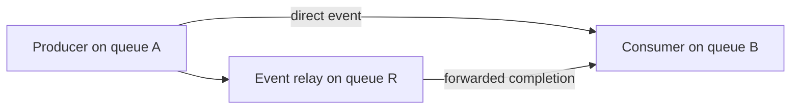

# Why a stream microbenchmark can miss the HiSparse regression

Working hypotheses by Streams Investigator, written before the requested Fable
review, 2026-09-18. See [the architecture proposal](STREAM_WAIT_DESIGN.md).

The mismatch is partial: grouped prefetch with 25 kernels per layer reproduces
the ordering/admission interaction, while the earlier small-copy and four-kernel
cases did not. We have not established which particular waits cause the model
result, or that a microscopic saving scales linearly to a token.

> **Review update:** [Fable feedback and our corrections](STREAM_WAIT_REVIEW.md) move
> a count/duration/readiness test ahead of the relay test below. Both are hypotheses;
> producer duration alone is challenged by the existing large-kernel regression.

## Ranked explanations to test

| Priority | Hypothesis | Why our micro can miss it | Evidence and limits |
|---|---|---|---|
| 1 | **A wait inherits the wrong description of its producer work.** A small relay stage can depend on a long producer yet publish short or missing history. | Direct two-stream tests attach the long producer directly to its consumer. Real graph/eager/copy chains can forward the dependency through another queue or engine. | The source resets independent history and does not propagate arbitrary upstream history. Bypass helps C1. Neither establishes that these are the waits responsible for C1; per-generation evidence is missing. |
| 2 | **Wait readiness differs when the GPU reaches it.** | Per-replay synchronization and uniform submission differ from a resident server submitting graph/eager bursts. A large host-side backlog can drain before a later wait executes. | Queued short-chain regressions show why host backlog alone is unsafe. Depth controls already tested some of this. Actual model submission/readiness distribution remains unknown. |
| 3 | **Same bytes, different transfer/dependency path.** | Pinned-host gather consumes GPU compute; a copy may use SDMA or another implementation. Backup completion and buffer reuse may move a wait onto the critical path. | Engine transitions reset history. Small-copy pipeline traces already show useful overlap being consumed by other costs. Transfer size or API name alone does not identify the executed engine. |
| 4 | **Physical queue topology or TP progress differs.** | One GPU/one process omits collectives, rank skew and some pooled-queue competition. | Queue collisions were directly observed in expert graphs. TP effects on the current C1 discrepancy are plausible but not isolated; no evidence yet justifies a large multi-GPU sweep. |
| 5 | **Kernel shape and timing scope hide the cost.** | A synthetic underfilled attention grid differs from model GEMMs; splitting kernels adds traffic and changes graph partitioning. GPU-event intervals omit some host/token delivery costs. | Widening the grid alone did not solve the mismatch; eager negative controls shifted alongside marker results. End-to-end and component clocks must remain distinct. |

The first two fit the admission evidence best. The original next experiment proposed testing
**dependency provenance before inventing a new graph-role classifier**. The reviewed
plan first runs the dispatch-count sweep and uses a model census to prioritize this test. If expert
and prefetch edges have indistinguishable roles, a role whitelist merely moves the
kernel-count heuristic into a different representation.

## First separating experiment: direct versus relayed completion

Use one GPU, a fixed long producer and a fixed consumer with an independent CPU
oracle. Compare these dependency paths while leaving useful producer/consumer work
unchanged:

The extra relay is the intentional variable, not free work. First use no useful
relay computation; confirm whether the runtime creates a distinct completion
signal or optimizes the relay away. Then test a short producer as a negative
control. Use guarded and bypass controls on the same bytes, plus stock; keep graph
ordering and marker omission fixed. Start with eager launches and then capture the
same dependency structure, checking the actual resulting segments and queues.

Primary comparison is the **change in native-wait benefit between direct and relay
paths**, not the raw cost of adding a relay. Record total and producer completion
time, consumer handoff and host submit/completion separately. Retain all trials.
In a separate diagnostic pass, match producer signal generation to the admission
reason, recorded history, producer/consumer queue IDs and engine. Do not match
recycled signal handles across a whole run without generation information.

A useful signature would be: the direct long producer benefits under guarded
admission; the relay loses admission and the benefit; bypass restores it; the short
negative control stays neutral under guarded admission. Even this would prove a
mechanism, not its occurrence in C1. If the relay keeps the same provenance/admission,
or bypass fails to recover the lost benefit, reject this explanation for that case.

Only after this test, vary consumer arrival, add a real small KV transfer, or replay
production-derived topology. Do not combine those variables in the first fixture.

## Minimum model metadata for a representative replay

Capture one bounded untimed diagnostic step: graph/eager submission boundaries,
ordered segment/edge IDs, actual physical queues, engine transitions, kernel shapes,
transfer direction/size, buffer-reuse dependencies, signal generations and admission
reason counts. Separate CPU submission timestamps from GPU ordering observations.
No tensor values or full checkpoint capture are needed for this structural test.
Profiling can change queue/read-index behavior, so use it to describe topology and
cross-check with an unprofiled replay, not to declare unbiased admission frequency.

Replay that structure with deterministic synthetic data and correctness checks.
Preserve dependent work and queue-pressure distributions before matching total
runtime. Move to a bounded two-/four-GPU miniature only if a collective/rank-skew
edge is needed to reproduce the behavior. This is not a request for production
reruns, application tuning, or investigation of multi-second gaps.
