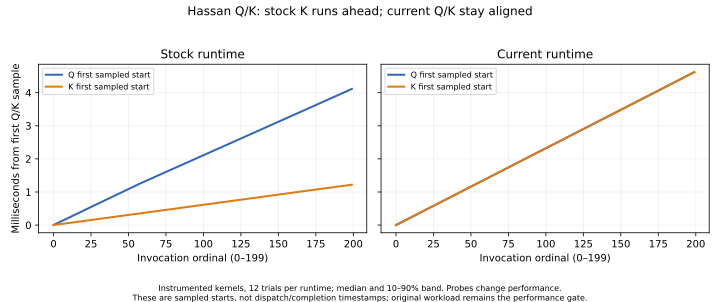

# Calibrated Q/K timeline — jobs 52978, 52985 and 53002

The instrumented Hassan burst exhibits a repeatable scheduling difference: stock's K branch advances far ahead of Q across 200 graph replays, whereas the current runtime keeps their invocation ordinals aligned. This is evidence about the diagnostic execution, not a quantitative decomposition of the original regression. The unchanged benchmark still fails: current event-graph replay is about 2.34 us slower than stock in this cohort.

## Calibration before interpretation

Job52985 completed on node2/one GPU. Six retained trials per state, two reversed process orders, stock/current × serial/events × original/instrumented produced 16 processes, 144 timing rows, 608 numerical checks and 5,376,000 recorded wave invocations. Remote and local artifact audits pass. Original kernels are untouched; recording off/on uses identical instrumented binaries within each process. All three library-map phases, exact dispatch configurations and seeded input identities are retained. This is a diagnostic calibration, not production qualification.

GPU microseconds per Q/K pair, including the original 200-replay burst protocol:

| Runtime / schedule | Original kernels | Instrumented, recording off | Same binaries, recording on |
| --- | ---: | ---: | ---: |
| Stock / serial | 19.2113 | 19.4481 | 20.3298 |
| Current / serial | 19.1538 | 19.3304 | 20.2152 |
| Stock / events | 19.8384 | 20.0012 | 20.6924 |
| Current / events | 22.1780 | 22.2609 | 23.2410 |

Recording costs 0.6912 us for stock/events and 0.9801 us for current/events. Even disabled instrumentation changes code generation and adds argument/control accesses. A single probe-overhead subtraction cannot reconstruct uninstrumented behavior.

## What the sampled starts show

The plot uses first sampled wave starts, with a common integer device-clock origin removed within each trial. Lines are medians and bands are 10th–90th percentiles across twelve traces per runtime. There is no host/device clock-epoch subtraction.

With stock/events, K's median start-to-start interval is about 6.05 us, while Q's is 20.28 us. In representative trials, invocation100 starts near 0.61 ms for K and 2.11 ms for Q; invocation199 starts near 1.22 ms and 4.11 ms respectively. Their lead grows throughout the burst, rather than resembling a constant clock offset. Q overlaps different K invocation ordinals early in the burst; all K samples finish well before the last Q samples.

With current/events, both start-to-start intervals are about 23.16 us and matching Q/K ordinals start within a small fraction of a microsecond. Their sampled envelopes overlap by about 4.63 us. Serial controls preserve Q→K→next-Q order and have no sampled Q/K overlap.

Current/event Q and K envelopes are longer than serial envelopes, consistent with contention or scheduling effects under concurrent execution. This is a hypothesis about the mechanism, not proof of an occupancy change or a measured MFMA utilization loss. Overlapping envelopes do not prove simultaneous instruction issue.

These observations are specific to Hassan's 200-replay burst. The expert benchmark synchronizes before and after each single replay; cross-replay advancement cannot explain its regression. Neither result establishes a new HiSparse performance conclusion.

## Probe semantics and resource checks

One recording lane per wave writes fixed-frequency `S_MEMREALTIME` samples into separate Q/K buffers. Q has 512 writers and K has 48; each records 200 invocations. The HIP clock query reports 100 MHz; job53002 supplies resource data for the exact extracted ELF kernels. No new CTA barriers or cross-stream logging counter are introduced. The original four-node graph remains: two lazy initialization kernels, Q and K, with unchanged grids/blocks/dependencies.

Actual generated code qualifies the endpoint: the end clock follows the original output atomics, an enabled-value load and `vmcnt(0)`, then a counter load and another `vmcnt(0)`. It measures an **instrumented per-wave sample interval**, including probe-driven drainage. Trace stores, packet retirement and final publication can still follow. It is not a timestamp immediately at the original last output issue, nor a graph-completion timestamp.

| Kernel resource | Q original → instrumented | K original → instrumented |
| --- | ---: | ---: |
| VGPRs | 56 → 70 | 46 → 52 |
| SGPRs | 41 → 38 | 36 → 40 |
| LDS bytes | 61,440 → 61,440 | 61,440 → 61,440 |
| Scratch bytes | 0 → 0 | 0 → 0 |
| Kernarg bytes | 56 → 64 | 56 → 64 |
| SDK maximum resident blocks/CU | 2 → 2 | 2 → 2 |

The queried MI355X has 256 compute units and 163,840 LDS bytes/CU. The SDK occupancy ceiling is unchanged; actual concurrent occupancy was not measured. Static MFMA counts remain 32 per kernel and CTA-barrier counts remain Q9/K13. Additional waits are present. All eight ELF copies for each kernel/variant are hash-identical across runtimes, schedules and rounds.

Independent review checked all 96 raw arrays: no holes, overwrites or per-writer nonmonotonicity, and every kernel's next invocation starts after all sampled ends of its preceding invocation. All serial Q→K and K→next-Q boundaries also pass. This supports ordinal pairing in these artifacts; it does not establish zero cross-die clock skew.

Q/K clocks omit initialization work, waiting before the first sample, and activity after the last sample. Event elapsed minus Q/K coverage must not be labeled barrier cost. The current instrumented interpair unsampled interval (~17.63 us) includes multiple such components.

## Consequence for the next architecture decision

Investigate the cost of preserving graph-entry order and the choice to use separate queues. The stock advancement pattern cannot simply be copied while weakening required stream semantics. A general placement policy should account for the benefit of useful overlap versus queue/dependency cost, and must retain parallel execution where it wins. The original serial result shows useful headroom for this small graph, but does not by itself justify a shape-specific policy or universal serialization.

Claude Fable xhigh was asked to review the new evidence; that invocation returned an organization spend-limit error before review. The user-authorized independent Codex xhigh review is the fallback. No new runtime was promoted by these observations.

Raw artifacts: `iterations/hassan-qk-micro-20260918/timestamp-v1-j52978`, `timestamp-calibration-j52985`, `occupancy-observation-j53002`. Frozen source/spec: `timestamp_v1`, `timestamp_calibration`, `timestamp-calibration-spec.json`; reduction: `analyze_timestamp.py`, `plot_timestamp.py`. Job52978 was a successful compilation/indexing pilot; all artifacts remain retained.

Calibration spec SHA256: `1074403af6c428a203fba5b386a8f84f81f078011df2df79743cd14deb2bacc2`. Manifest SHA256: `1b601d369caef9409cbf9725ae80bdf73759afd0087b6e39b4bfe5ab18712150`.
