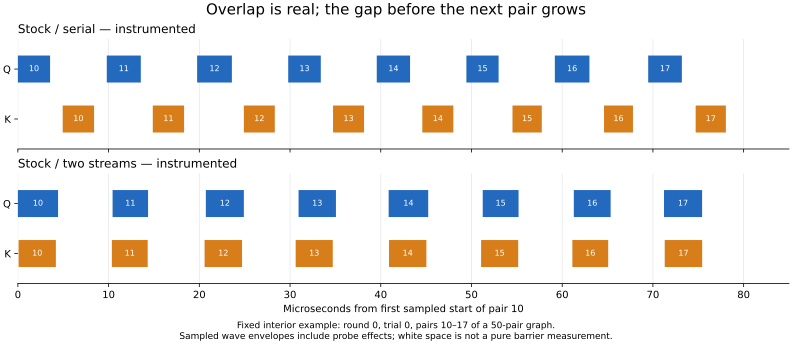

# Stock Q/K overlap: where the saving goes — job 53817

Hassan's expectation of useful overlap is reasonable. The measured stock kernels can overlap; in the grouped graph, the larger interval before the next pair cancels that benefit. There is also some kernel-envelope inflation during overlap. The evidence points toward graph submission and completion/dependency scheduling as the next target, rather than an assumption that these kernels cannot execute concurrently. It does not yet isolate a command-processor firmware mechanism or explain his full serving-cadence regression.

This follows [the capture-initialization study](STOCK_MECHANISM_RESULTS.md). Stock HIP/HSA and both original GEMM ELFs are unchanged. The actual capture stream is prewarmed, with zero captured fill kernels. The historical cold-capture benchmark remains intact. Both jobs completed, released their single-GPU node2 allocations and passed remote and independent local audits.

## Uninstrumented measurements

Microseconds per projection pair unless indicated; four reversed/rotated process orders, eight retained trials, 200 units per timed window. Grouping is an explicitly separate diagnostic: it changes graph structure and output buffers, and preserves a join between each pair. It is not merely a host-loop rewrite.

| Stock workload | GPU us | Host completion us | CPU submission us |
|---|---:|---:|---:|
| Q only, 50/graph; per Q | 4.652501 | 4.689938 | 0.090225 |
| K only, 50/graph; per K | 4.421295 | 4.460350 | 0.091850 |
| Serial Q+K, 1 pair/graph | 13.603998 | 13.641566 | 2.412289 |
| Two streams, 1 pair/graph | 14.161520 | 14.200442 | 4.427363 |
| Serial Q+K, 50 pairs/graph | 8.831393 | 8.868875 | 0.096475 |
| Two streams, 50 pairs/graph | 10.048479 | 10.088200 | 5.357400 |

The one-pair loss is 4.10%; the 50-pair loss is 13.78%. Both losses repeat in all four process rounds. The earlier independent allocation 53773 measured 4.20% and 13.54% respectively.

Q-only 4.65us and K-only 4.42us make a large idealized overlap saving plausible against serial 8.83us. They include amortized dispatch and are not pure kernel durations; `max(Q,K)` is an optimistic empirical reference, not a proven achievable bound. Arithmetic imbalance alone cannot dismiss the expectation of a large win.

Submission also matters: at 50 pairs/graph the parallel graph costs 5.36us of CPU submission per pair versus 0.096us serial. The second stream changes segmentation/dependency handling throughout the graph. GPU-event elapsed time includes idle periods and must not be labeled pure GPU work. This observation does not assign the device's inter-pair interval entirely to the CPU.

## Direct sampled timeline

One lane per wave records the same calibrated device-clock probe as job 52985: Q has 512 writers, K 48. There are 32 traces per schedule/group and 6,400 sampled pairs. Every writer has exactly 200 invocations, no holes, no same-kernel overlap across successive ordinals, and all within-graph pair joins pass. All 6,400 serial pairs have no sampled Q/K overlap; 6,277/6,400 grouped parallel pairs (98.08%) overlap.

| Median statistic, instrumented 50-pair graph | Serial us | Two streams us |
|---|---:|---:|
| Q sampled envelope |3.7325|4.2300|
| K sampled envelope |3.4000|4.1250|
| First Q/K start to last Q/K sampled end |8.6300|4.2975|
| Interval from that end to next pair's sampled start, inside graph |1.4000|6.0175|
| Q start-to-start interval |10.0300|10.3200|

Useful overlap is visible, with Q and K starting almost together. Q's sampled envelope grows about 13%, K's 21%; nevertheless the pair's span approximately halves. The following interval grows by about 4.62us, offsetting the span reduction of about 4.33us **within the instrumented observation**. Statistics are separate medians and need not add exactly. They are not a numerical decomposition of the uninstrumented 1.217us regression.

The figure shows a declared interior slice, round 0/trial 0/pairs 10–17, to make the per-pair join visible. All trials and graph boundaries remain in the raw data and aggregate results; no performance trial is excluded.

The one-pair burst has a different schedule: stock K advances at roughly 6.15us per invocation while Q advances at 14.64us. Matching Q/K ordinals therefore rarely overlap, but Q can overlap K from a different replay. A same-ordinal overlap metric alone would be misleading. Grouping makes the internal joins explicit and gives the more interpretable per-pair observation above. This does not justify weakening application stream dependencies to copy stock's advancement pattern.

## Calibration and what is still unknown

GPU us, original kernels versus instrumented binaries with recording disabled/enabled:

| Schedule/group | Original | Probe off | Probe on |
|---|---:|---:|---:|
| serial / 1 |13.603998|13.678750|14.762185|
| serial / 50 |8.831393|9.163054|10.159386|
| events / 1 |14.161520|14.268516|14.796387|
| events / 50 |10.048479|10.153334|10.752005|

Instrumentation affects both code generation and recording cost, and affects serial more than parallel. For grouped serial, recording adds 0.996us; for grouped parallel, 0.599us. Do not subtract a universal probe tax or treat near-parity with probes as uninstrumented parity. Original/off/on kernels and all ELF identities were checked against 52985: original Q64ff901c..., K4102344b...; instrumented Q3a1bcfd8..., K58a6f12d.... SDK occupancy remains capped at two blocks/CU in these binaries, as measured previously; actual occupancy was not measured here.

The roughly 6us interval contains work after the last sample, packet retirement, queue/dependency handling, dispatch and potentially host supply. The probe's endpoint includes waits and does not mark original kernel completion. Cross-die clock skew was not independently calibrated. Longer Q/K envelopes suggest interference but do not establish HBM saturation, MFMA utilization, split-K spin duration or a firmware bug. These short kernels share matrix, cache/memory and LDS resources; hardware headroom cannot be inferred from low occupancy alone.

Next, isolate the repeated join/next-dispatch path with exact packet and host-enqueue observations, keeping these GEMMs and dependencies fixed. A controlled pre-submission experiment can distinguish late host supply from already-queued device delay; producer completion, dependency readiness and consumer start must be measured separately. Then use calibrated targeted counters to distinguish scheduling effects from kernel resource interference. Do not tune split-K or serialize the benchmark to manufacture a two-stream win. There is no need to rerun Hassan's full production setup for that next step.

Hassan's original serving report selected 32 Q/K dispatch pairs with no positive overlap; this warm grouped extraction does not reproduce that entire surrounding graph or its cache state. It narrows the mechanism and shows that the hardware can overlap the exact projection kernels. It does not attribute the full serving result to one measured microbenchmark interval.

## Validation and provenance

40 fresh processes, 448 retained timing rows, 6,096 numerical checks; 256 raw Q/K trace arrays from 128 traces. Exact sources, controls, mapped libraries, input bytes, dispatch, graph node counts, zero fills, numerical outputs and artifact hashes all pass. Independent local audit and trace reduction pass, including all within-graph joins. Correctness remains a bounded synthetic-input screen.

Stock HIP f1043337461c8e54ee135e95fa979a7d0e4344676ad5b0554652f844f8f098ac; HSA b8cdfe93d343649a35c1daf73a0a3a6840f09379ebeee9be65670461ffea43f4. Frozen spec SHA256:161dfc9822746cc1b1f202b02cfbed6efa421613e1e0b516893f5789dbe813a9; manifest SHA256:b6db250d0232a961308dec330d11a50ec8761f64fab00689943f73f4a87b12b9.

Local root:`/home/sashawork/dev/amd-runtime-production/iterations/hassan-warm-timeline-20260918`; remote mirror:`/workspace/home/sasha/amd-runtime-production/iterations/hassan-warm-timeline-20260918`. Frozen launch inputs:benchmark.py,run.py,spec.json,instrument.py,splitk_hgemm_timestamp.py,source-manifest.json,libprobe_info.so. Raw:results-j53817; post-run reductions:timeline.json,elf-audit.json; reduction sources:reduce.py,plot.py. Use the existing Hassan `.analysis-venv` Python for local NumPy audits. No runtime rebuild or deployment promotion.
